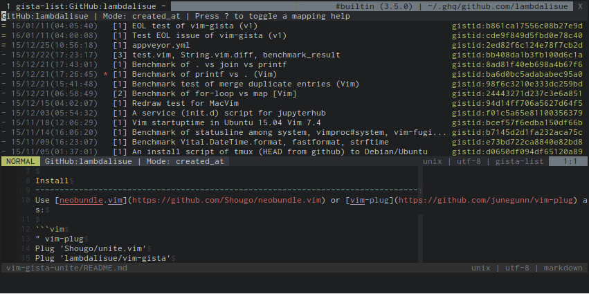

vim-gista
===============================================================================
[](https://travis-ci.org/lambdalisue/vim-gista)
[](https://ci.appveyor.com/project/lambdalisue/vim-gista/branch/master)


[](LICENSE)
[](doc/vim-gista.txt)
[](https://github.com/vim-jp/vital.vim)



*vim-gista* is a plugin for manipulating [Gist](https://gist.github.com/) in Vim.
It provide the following features:

- List gists of a particular lookup
- List commits of a gist
- Open a gist as a JSON file
- Open a file of a gist
- Post a content of the current buffer
- Patch a content of the current buffer to a gist
- Rename files in a gist
- Remove files in a gist
- Delete a gist
- Star/Unstar a gist
- Fork a gist

Requirements
-------------------------------------------------------------------------------
One of the following is required for communicating with Gist API.

- Vim compiled with `+python` (Recommended)
- [cURL](http://curl.haxx.se)
- [wget](https://www.gnu.org/software/wget)

To enable fast feching in `:Gista-list`, you need a Vim compiled with
`+python` or `+python3`.
Note that Vim compiled with `+python3` without cURL or wget is not supported for
now. The recommended environment is a Vim compiled with `+python` or a Vim
compiled with `+python3` with cURL or wget.

Install
-------------------------------------------------------------------------------
Use [dein.vim](https://github.com/Shougo/dein.vim) or [vim-plug](https://github.com/junegunn/vim-plug) as:

```vim
" vim-plug
Plug 'lambdalisue/vim-gista'

" dein.vim
call dein#add('lambdalisue/vim-gista')

" dein.vim (Lazy)
call dein#add('lambdalisue/vim-gista', {
    \ 'on_cmd': 'Gista'
    \})
```

Or install the repository into your `runtimepath` manually.


Usage
-------------------------------------------------------------------------------

First of all, specify your GitHub username into `g:gista#client#default_username` or use `$ git config github.user {USERNAME}` to record it into your .gitconfig file then vim-gista automatically resolve your github username from your .gitconfig file.
vim-gista support an anonymous access but authorization is strongly recommended due to the GitHub API rate-limit.

After that, execute `:Gista list`. It will request all your gists and show `gista-list` window which looks like:

```
  ┌ API name
  │       ┌ Lookup
  │       │                  ┌ The current mode
  │       │                  │
GitHub:lambdalisue | Mode: updated_at | Press ? to toggle a ma...
- 15/12/31(07:08:22)   [3] test.vi... gistid:bb408da1b3fb100d6c1a
= 15/12/27(17:58:56) * [2] benchma... gistid:c84fe3e0b306a2bc8578
│       │            │  │     │                     │
│       │            │  │     │                     └ GistID
│       │            │  │     └ Description
│       │            │  └ The number of files
│       │            └ Is starred marker (*: starred)
│       └ A created_at/updated_at of the gist (depends on the Mode:)
└ Fetched marker (-: Unfetched, =: fetched)
```

In `gista-list` window, you can check the mappings by hitting `?`.
See `:help vim-gista-usage` for more detail.


Harmonic plugins
-------------------------------------------------------------------------------
You may want to checkout the following harmonic plugins:

- [vim-gista-unite](https://github.com/lambdalisue/vim-gista-unite) : Allow users to use unite.vim interface for listing
- [vim-gista-ctrlp](https://github.com/lambdalisue/vim-gista-ctrlp) : Allow users to use ctrlp.vim interface for listing

Let me know if you make a harmonic plugin ;-)

For users who use a previous version (v0.1.18)
-------------------------------------------------------------------------------
Most of features, commands, or options are drastically changed from a previous version (v0.1.18).
See [Migration from v1 to v2](https://github.com/lambdalisue/vim-gista/wiki/Migration-from-v1-to-v2) or use [`v0.1.18`](https://github.com/lambdalisue/vim-gista/tree/v0.1.18) tag for instance.

License
-------------------------------------------------------------------------------
The MIT License (MIT)

Copyright (c) 2014-2016 Alisue, hashnote.net

Permission is hereby granted, free of charge, to any person obtaining a copy
of this software and associated documentation files (the "Software"), to deal
in the Software without restriction, including without limitation the rights
to use, copy, modify, merge, publish, distribute, sublicense, and/or sell
copies of the Software, and to permit persons to whom the Software is
furnished to do so, subject to the following conditions:

The above copyright notice and this permission notice shall be included in
all copies or substantial portions of the Software.

THE SOFTWARE IS PROVIDED "AS IS", WITHOUT WARRANTY OF ANY KIND, EXPRESS OR
IMPLIED, INCLUDING BUT NOT LIMITED TO THE WARRANTIES OF MERCHANTABILITY,
FITNESS FOR A PARTICULAR PURPOSE AND NONINFRINGEMENT. IN NO EVENT SHALL THE
AUTHORS OR COPYRIGHT HOLDERS BE LIABLE FOR ANY CLAIM, DAMAGES OR OTHER
LIABILITY, WHETHER IN AN ACTION OF CONTRACT, TORT OR OTHERWISE, ARISING FROM,
OUT OF OR IN CONNECTION WITH THE SOFTWARE OR THE USE OR OTHER DEALINGS IN
THE SOFTWARE.

External vital modules used in this plugin
-------------------------------------------------------------------------------
vim-gista is powered by the following external [vital](https://github.com/vim-jp/vital.vim) modules.

- [lambdalisue/vital-ArgumentParser](https://github.com/lambdalisue/vital-ArgumentParser)
- [lambdalisue/vital-Vim-Prompt](https://github.com/lambdalisue/vital-Vim-Prompt)
- [lambdalisue/vital-Vim-Validate](https://github.com/lambdalisue/vital-Vim-Validate)
- [lambdalisue/vital-Vim-Buffer-Anchor](https://github.com/lambdalisue/vital-Vim-Buffer-Anchor)
- [lambdalisue/vital-Web-API-GitHub](https://github.com/lambdalisue/vital-Web-API-GitHub)
